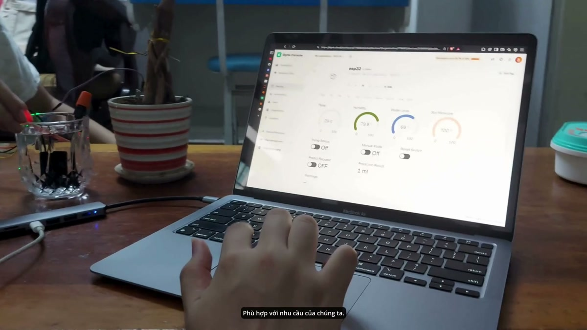
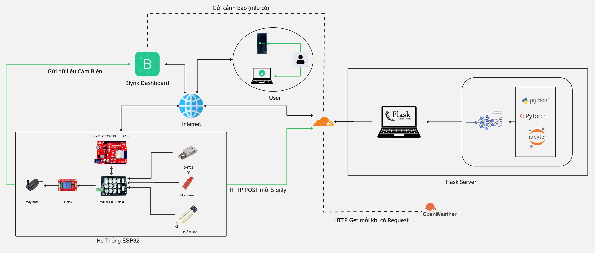
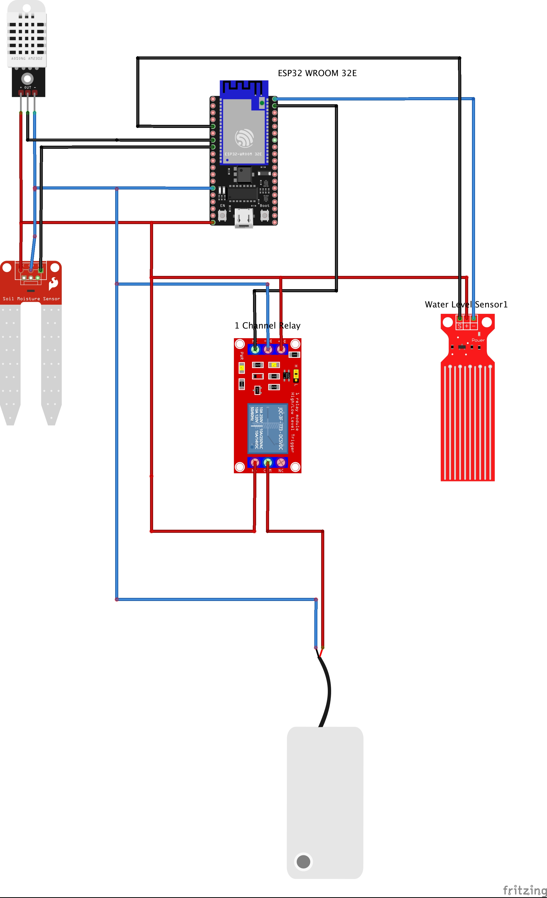
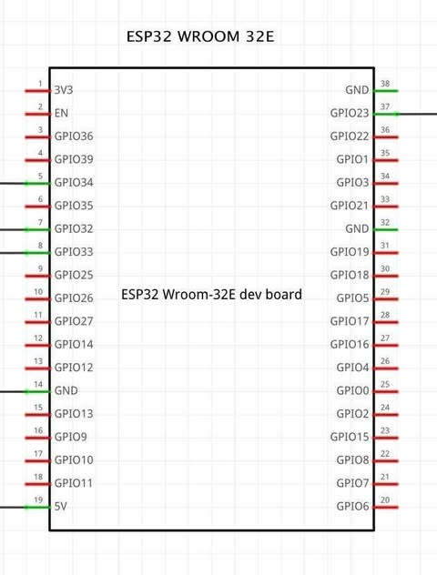
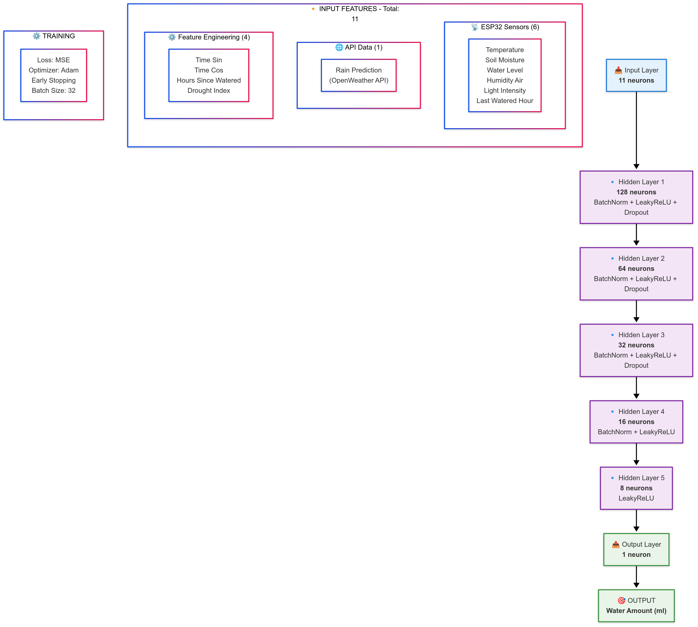

# ESP32 Smart Irrigation System with Deep Learning

<p align="center">
  
  
  
  
  
  
</p>

An intelligent plant irrigation system combining **ESP32** hardware with a **Flask** server integrated with a **PyTorch deep learning model** to optimize water usage based on real-time environmental conditions and weather forecasts.

---

## Demo

[](https://drive.google.com/file/d/1WFX6o7PApAYUDOxUM-Q_vFmj2AuY5jzK/view?usp=sharing)

---

## System Architecture



| Layer | Technology | Role |
|-------|-----------|------|
| **Sensor** | ESP32 + DHT22, soil moisture, water level | Collect environmental data |
| **API** | Flask (Python) | Central logic & weather integration |
| **Weather** | OpenWeatherMap API | Cloudiness, rain forecast, lux estimation |
| **Model** | PyTorch WaterNet (8-layer MLP) | Predict optimal water amount (ml) |
| **Control** | Blynk IoT platform | Remote monitoring & manual override |

---

## How It Works

1. **ESP32** reads sensors (temperature, humidity, soil moisture, water level) every second
2. Every **7 hours**, it sends a POST request to the Flask server with sensor data
3. **Flask server** fetches real-time weather data from OpenWeatherMap (HCMC, Vietnam)
4. Server engineers 10 features and normalizes them (same pipeline as training)
5. **WaterNet model** predicts the precise amount of water needed (ml)
6. ESP32 runs the pump for `prediction / 10` seconds (10 ml/s flow rate)
7. Users monitor & control via **Blynk mobile app** (auto/manual mode, real-time data)

---

## Hardware Setup

### Pin Mapping

| Sensor / Actuator         | GPIO Pin | Type     |
|---------------------------|----------|----------|
| DHT22 (Temperature & Humidity) | GPIO32   | Digital  |
| Soil Moisture (Analog)    | GPIO33   | Analog   |
| Water Level (Analog)      | GPIO34   | Analog   |
| Pump Relay                | GPIO23   | Digital  |





---

## ML Model — WaterNet



### Architecture

8-layer MLP with skip-connection style structure:

```
Input(10) → Linear(128) → BatchNorm → LeakyReLU(0.1) → Dropout(0.2)
         → Linear(64)   → BatchNorm → LeakyReLU(0.1) → Dropout(0.2)
         → Linear(32)   → BatchNorm → LeakyReLU(0.1) → Dropout(0.1)
         → Linear(16)   → BatchNorm → LeakyReLU(0.1)
         → Linear(8)    → LeakyReLU(0.1)
         → Linear(1)
```

### Performance (Test Set)

| Metric | Value |
|--------|-------|
| MSE    | 255.41 |
| RMSE   | 15.98 |
| MAE    | 5.09 |
| **R²** | **0.8951** |

### 10 Input Features (order-sensitive)

| # | Feature | Source |
|---|---------|--------|
| 1 | `temperature` | DHT22 |
| 2 | `soil_moisture` | Analog sensor |
| 3 | `water_level` | Analog sensor (threshold 20% → 0/1) |
| 4 | `humidity_air` | DHT22 |
| 5 | `light_intensity` | Derived from weather cloudiness |
| 6 | `rain_prediction` | OpenWeatherMap rain field |
| 7 | `time_sin` | Cyclical encoding of hour |
| 8 | `time_cos` | Cyclical encoding of hour |
| 9 | `hours_since_watered` | `last_watered_hour % 24` |
| 10 | `drought_index` | `temp / (humidity + 1) × 10` |

**Normalization:** StandardScaler or RobustScaler (auto-detected during training — RobustScaler if >5% outliers exist).

---

## API Documentation

### POST `/predict`

**Request** (JSON):

```json
{
  "temperature": 30.5,
  "soil_moisture": 45,
  "water_level": 1,
  "humidity_air": 60,
  "last_watered_hour": 5
}
```

| Field | Type | Description |
|-------|------|-------------|
| `temperature` | float | Air temperature (°C) |
| `soil_moisture` | int | Soil moisture (0–100%) |
| `water_level` | int | Tank level: `1` (≥20%), `0` (<20%) |
| `humidity_air` | float | Air humidity (%) |
| `last_watered_hour` | int | Hours since last watering |

**Success Response:** `180` (integer — ml of water to dispense)

**Error Responses:**
- `400` — Missing field(s)
- `-1` — Weather API unavailable
- `500` — Server / model error

<details>
<summary><b>curl Example</b></summary>

```bash
curl -X POST http://localhost:5000/predict \
  -H "Content-Type: application/json" \
  -d '{"temperature":30.5,"soil_moisture":45,"water_level":1,"humidity_air":60,"last_watered_hour":5}'
```
</details>

---

## Blynk Virtual Pins Reference

| VPin | Widget | Direction | Function |
|------|--------|-----------|----------|
| V0 | Gauge | Display | Temperature (°C) |
| V1 | Gauge | Display | Air Humidity (%) |
| V2 | Gauge | Display | Soil Moisture (%) |
| V3 | Gauge | Display | Water Level (%) |
| V4 | Switch | Control | Manual Pump On/Off (locked during ML watering) |
| V5 | Switch | Control | Auto/Manual Mode (1=auto, 0=manual) |
| V6 | Button | Control | Manual predict trigger (calls `/predict`) |
| V7 | Label | Display | ML Prediction result (`"180 ml"`) |
| V8 | Button | Control | Restart ESP32 |
| V9 | Label | Display | Server warnings / error alerts |

> **Note:** Manual mode (V5=0) allows V4 pump control. ML auto-watering locks V4 while pump is running. Switching from manual to auto turns off any active pump.

---

## Setup

### 1. Flask Server

```bash
cd Flask_server
python3.11 -m venv venv
source venv/bin/activate
pip install -r requirements.txt
```

Create `Flask_server/.env`:

```env
OPENWEATHER_API_KEY=your_key
BLYNK_AUTH_TOKEN=your_blynk_token
```

Run:

```bash
python app.py    # starts on port 5000
```

#### Docker (optional — create `Dockerfile` + `docker-compose.yml` per [Flask_server/README.md](Flask_server/README.md))

```bash
docker-compose up --build
```

> Server runs on port **5050** in Docker mode.

### 2. ESP32 Firmware

1. Install **Arduino IDE** + [ESP32 board support](https://github.com/espressif/arduino-esp32)
2. Install libraries: `DHT sensor library`, `Blynk`, `HTTPClient` (built-in)
3. Copy `ESP32_client/secrets.h_example` → `ESP32_client/secrets.h` and fill in credentials
4. Upload `ESP32_client.ino` to ESP32

<details>
<summary><b>secrets.h template</b></summary>

```cpp
#define WIFI_SSID "your_wifi"
#define WIFI_PASSWORD "your_password"
#define BLYNK_AUTH_TOKEN "your_blynk_token"
#define FLASK_SERVER_URL "http://your-server-ip:5000/predict"
```
</details>

### 3. Blynk App

Create a new Blynk template with the pin mapping above. Widget layout recommendations are in [`ESP32_client/README.md`](ESP32_client/README.md).

---

## Project Layout

```
├── Flask_server/                # Flask API server
│   ├── app.py                   # Main server (WaterNet model, endpoints)
│   ├── models/                  # Trained model + scalers
│   │   ├── deep_model.pth
│   │   ├── scaler.pkl
│   │   └── y_scaler.pkl
│   └── .env                     # API keys (not tracked)
├── ESP32_client/                # ESP32 firmware
│   ├── ESP32_client.ino         # Main sketch
│   └── secrets.h                # WiFi/Blynk/Flask URL
├── Deep Learning Model Training/ # Training code & dataset
│   ├── model_claude.py          # Full training pipeline
│   └── results/                 # Training artifacts (.pth, .pkl)
├── res/                         # Centralized resources
│   ├── diagrams/                # System & hardware diagrams
│   ├── demo/                    # Demo video assets
│   ├── training/                # Training charts & metrics
│   └── data/                    # Datasets
├── AGENTS.md                    # AI assistant reference
└── README.md                    # This file
```

---

## Authors

- [thomasNguyen-196](https://github.com/thomasNguyen-196)
- [funxyz2](https://github.com/funxyz2)
